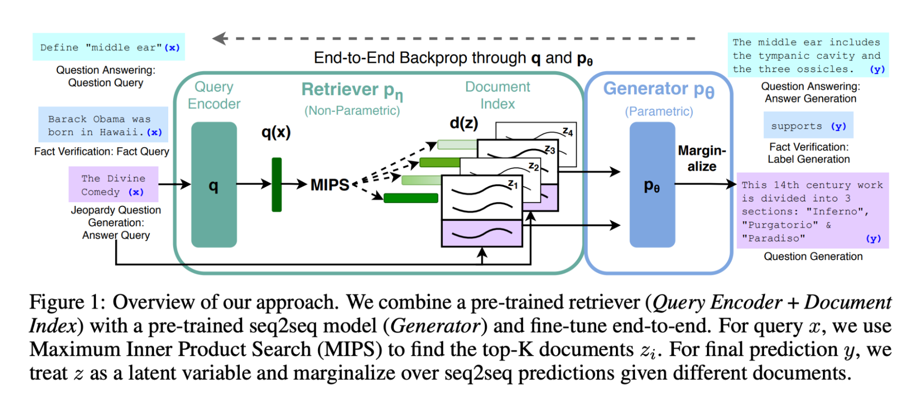

# AutoPE with RAG

RAG is a technique that has been used for some time to augment LLMs. It was presented by Facebook as a way to improve BART in 2020 and released as a component in the Huggingface library.

The idea is simple: combine a retrieval component with a generative one such that both sources complement each other (see diagram below from the [paper](https://arxiv.org/abs/2005.11401).

