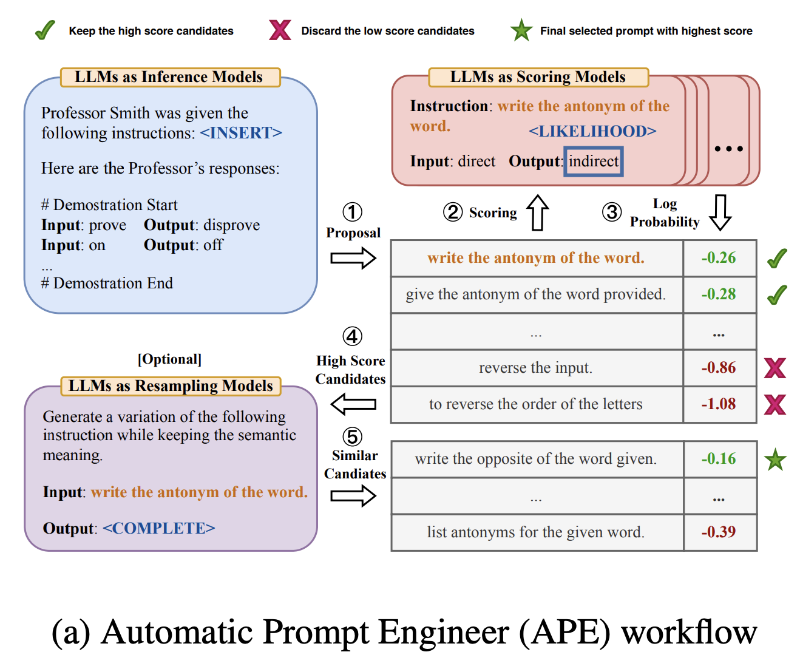

# AutoPE

AutoPE(APE, Automatical Prompt Engineering) refers to the approach in which prompts are automatically generated by LLMs rather than by humans. The method, introduced in the “Large Language Models Are Human-Level Prompt Engineers” paper, involves using the LLM in three ways: to generate proposed prompts, to score them, and to propose similar prompts to the ones scored highly (see diagram below).

